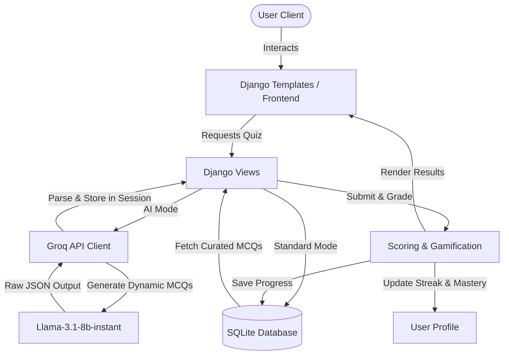

# Smart Assessment and Question Generation System 🧠🚀

<p align="center">
  
  
  
  
  
</p>

An advanced, AI-powered quiz platform built with **Django** and integrated with **Groq Cloud API** (`llama-3.1-8b-instant`). This application bridges traditional database-backed learning with dynamic, on-the-fly AI question generation and deep explanation retrieval.

---

## 🌟 Key Features

*   **👥 User Authentication & Profiles**: Secure registration, login, profile picture upload, and bio updates.
*   **🎮 Gamification & Engagement**:
    *   **Daily Streak System**: Tracks and increments your streak for consecutive days of activity.
    *   **Mastery Tracking**: Calculates your completion percentage dynamically as you complete assessments.
*   **📊 Interactive Analytics Dashboard**:
    *   Dynamic visualizations detailing score trends and quiz distribution by subcategory using **Chart.js**.
    *   Quick metrics displaying total quizzes completed, average score, and best score.
    *   Incomplete quizzes section to resume progress.
*   **⚔️ Dual Quiz Modes**:
    *   **Standard Mode**: Pulls curated questions from the local database. If a database explanation is missing, the system queries the **Groq API** to generate a custom 2-sentence explanation.
    *   **AI Mode (Dynamic Gen)**: Generates 100% custom multiple-choice questions (MCQs) in real-time about any subcategory and difficulty level using Groq's LLM.
*   **🏆 Global Leaderboards**: Ranks registered users based on their average scores across completed quizzes.
*   **📜 History & Retake Mechanics**: Detailed breakdown of past attempts showing questions, correct answers, your chosen answers, and explanations. Quick-retake options are available.
*   **🌱 Auto-Seeding**: A built-in command to instantly populate the database with 180 questions across all categories and difficulties.

---

## 📐 System Architecture



---

## 📁 Directory Structure

```text
smart_assessment_system/
│
├── core/                  # Project settings, settings.py, urls.py, wsgi/asgi
├── dashboard/             # Dashboard application (views, urls, templates)
├── quizzes/               # Core quiz logic (seeding, AI utils, views, urls)
│   ├── management/        # Custom seed commands (seed.py)
│   ├── models.py          # Category, Subcategory, Question, Choice, QuizAttempt, QuizSession
│   ├── utils.py           # Groq API integration (AI question generation)
│   └── views.py           # Play & scoring logic
├── users/                 # Authentication, profile management, and streaks
├── templates/             # Global HTML layouts and pages
├── static/                # Static assets (CSS, JS, profile pictures)
├── requirements.txt       # Project dependencies
├── db.sqlite3             # Local SQLite database
└── .env                   # Configuration for API keys
```

---

## ⚙️ Getting Started & Local Setup

Follow these steps to run the application on your local machine:

### 1. Clone the Repository
```bash
git clone <repository-url>
cd smart_assessment_system
```

### 2. Set Up a Virtual Environment
Create and activate a python virtual environment:
```bash
# On Windows
python -m venv venv
venv\Scripts\activate

# On macOS/Linux
python3 -m venv venv
source venv/bin/activate
```

### 3. Install Dependencies
```bash
pip install -r requirements.txt
```

### 4. Configure Environment Variables
Create a file named `.env` in the root directory and add your Groq API key:
```env
GROQ_API_KEY=your_groq_api_key_here
```

> [!IMPORTANT]
> A valid **Groq API Key** is required for AI Mode dynamic quiz generation and explanation queries. You can obtain a free key from the [Groq Console](https://console.groq.com/).

### 5. Apply Migrations
Set up your database tables:
```bash
python manage.py migrate
```

### 6. Seed the Database
Populate the database with the pre-packaged 180 questions (covering 12 subcategories across 3 difficulties):
```bash
python manage.py seed
```

> [!TIP]
> The `seed` command wipes existing questions to ensure a clean database state. Use it when setting up the system for the first time.

### 7. Run the Server
Launch Django's development server:
```bash
python manage.py runserver
```
Visit the system in your browser at `http://127.0.0.1:8000/`.

---

## 💡 Seeding & Categorization Details

The `python manage.py seed` command populates the database with three main categories:
1.  **Academic**: Physics, Chemistry, Mathematics, and Biology.
2.  **Entertainment**: Movies, Music, Gaming, and Celebrities.
3.  **General Knowledge**: History, Geography, Politics, and Current Affairs.

Each subcategory contains **15 hand-curated questions** split evenly across **Easy**, **Medium**, and **Hard** difficulties, providing an immediate database-backed quiz bank.